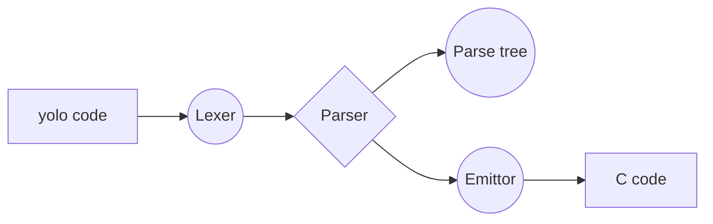
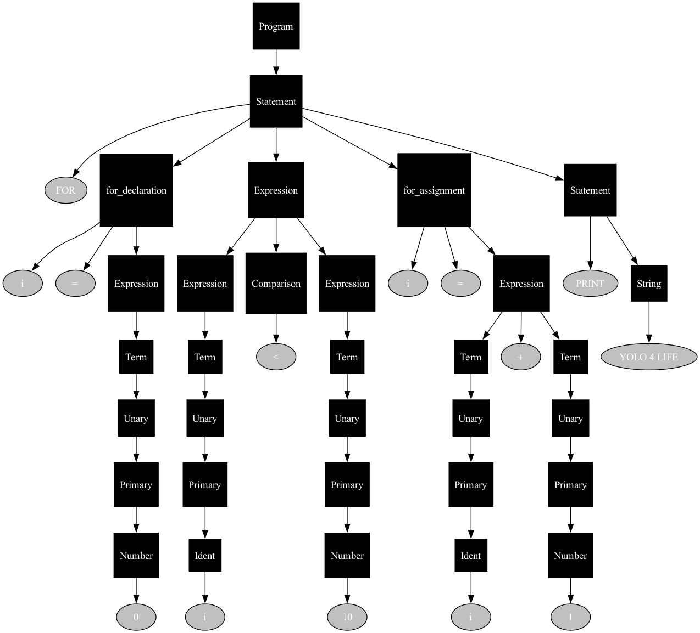
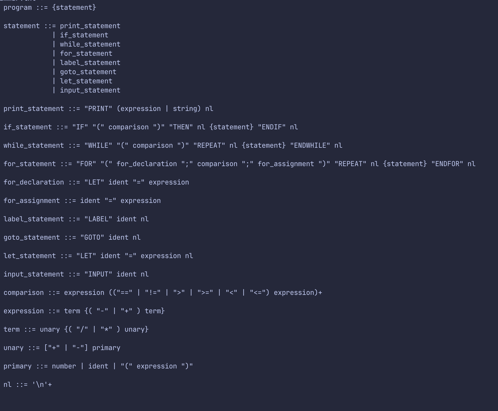
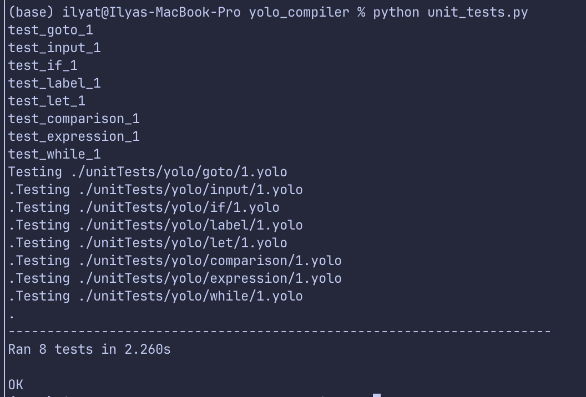

# Yolo to C compiler


A compiler that translates YOLO, a custom programming language, into C code. The compiler is structured into a lexer, parser, code emittor, and some unit tests.



Here is a sample of a yolo code:
```
FOR (LET i = 0; i<10; i = i+1) REPEAT
PRINT "YOLO 4 LIFE"
ENDFOR
```

The corresponding C code:
```c
#include <stdio.h>
int main(){
	for(int i=0;i<10;i=i+1){
		printf("YOLO 4 LIFE\n");
	}
	return 0;
}
```
The corresponding parse tree:


Here is the grammer for yolo language:


As you might be able to tell from the grammar, it only supports basic laguage features:
- Printing
- For + while loops
- If statements
- Simple expressions/comparisons
- labels + goto's

Nonetheless, its possible to make some interesting programs: 

```
LET terms = 10  # Number of Fibonacci terms to generate
LET a = 0
LET b = 1

PRINT "Fibonacci Sequence:"
PRINT a
PRINT b

FOR (LET i = 2; i < terms; i = i + 1) REPEAT
    LET next = a + b
    PRINT next
    LET a = b
    LET b = next
ENDFOR

```

I also included wrote some unit tests to test basic language features using the `unittest` framework.


I want to thank Austin Z. Henley for his very helpful [Let's make a Teeny Tiny compiler](https://austinhenley.com/blog/teenytinycompiler1.html) blog post which I used as the foundation for my compiler.
